# Robo-Fleet Control — Architecture

React 19 + TypeScript control UI for the Robo-Fleet distributed rover system. Turborepo pnpm monorepo with web browser and Tauri desktop targets sharing a common UI library. Connects to `orchestra/web_bridge` Rust backend via Socket.IO on port 3030.

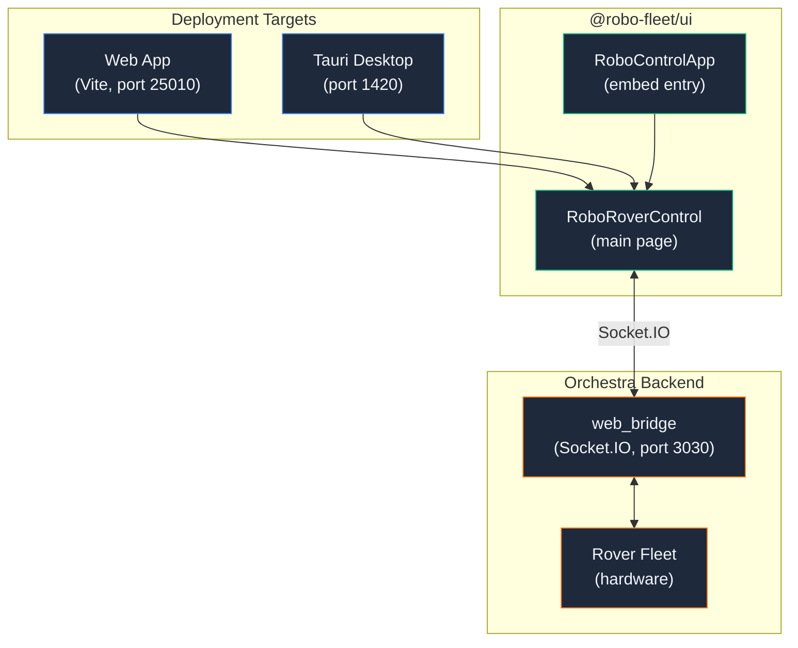

## Monorepo Structure

```
robo-control-app/
├── apps/
│   ├── web/           @robo-fleet/web     — Vite browser app
│   └── native/        @robo-fleet/native  — Tauri v2 desktop app
├── packages/
│   ├── ui/            @robo-fleet/ui      — Components, hooks, services, adapters
│   ├── shared/        @robo-fleet/shared  — Pure TS types & constants (zero deps)
│   ├── tsconfig/      Shared TS configs
│   └── eslint-config/ Shared ESLint rules
├── src/               LEGACY — pre-monorepo root app
└── old.app/           LEGACY — archived previous version
```

Both apps are thin shells — import `RoboRoverControl` from `@robo-fleet/ui` and pass env-based config (`VITE_SOCKET_IO_URL`, `VITE_AUTH_USERNAME`, `VITE_AUTH_PASSWORD`).

### Build Pipeline

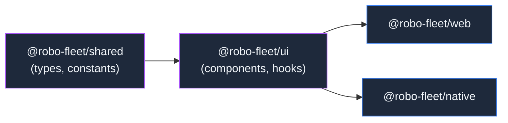

Turbo tasks: `build` (`dependsOn: ["^build"]`), `dev` (persistent, no cache), `check-types`, `lint`.

## Component Hierarchy

Atomic Design in `packages/ui/src/components/`:

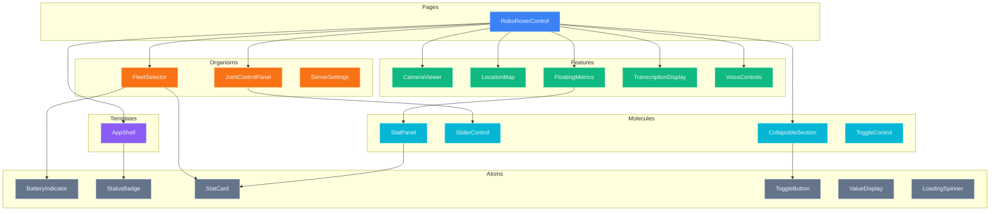

## Socket.IO Patterns

Two coexisting approaches:

| Pattern | Where Used | Approach | Status |
|---------|-----------|----------|--------|
| **A — Direct socket** | `RoboRoverControl`, `CameraViewer` | `useRef<Socket>()`, direct `io()` call | Active, production |
| **B — Service abstraction** | `AppShell`, hooks (`useConnection`, `useTelemetry`) | DI via `ServiceFactory`, callback pub/sub | Available, extensible |

### Pattern A — Direct Socket (Primary)

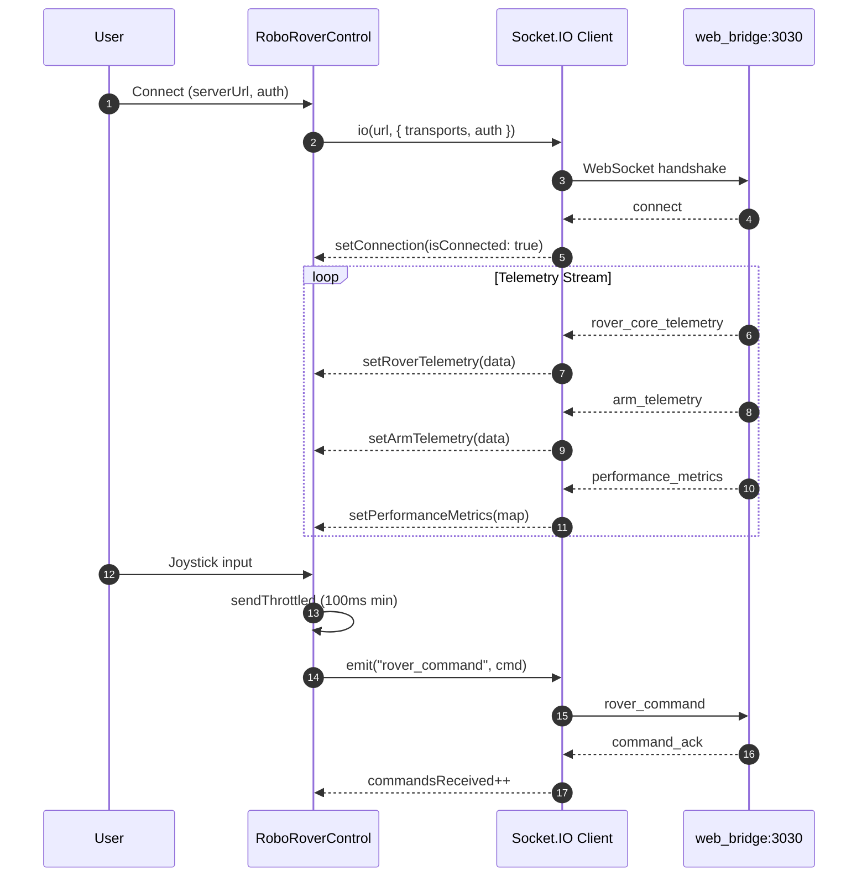

### Pattern B — Service Abstraction

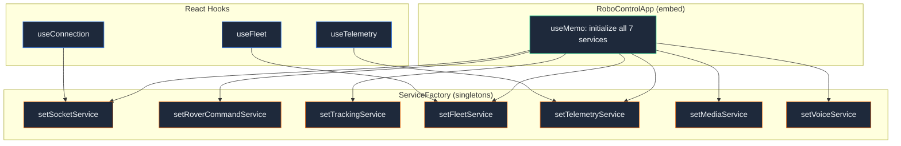

### Service Interfaces

7 interfaces in `packages/ui/src/adapters/factory/interfaces/`:

| Interface | Purpose | Key Methods |
|-----------|---------|-------------|
| `ISocketService` | WebSocket lifecycle + event pub/sub | `connect`, `disconnect`, `emit`, `on`, `onStatusChange` |
| `IRoverCommandService` | Movement/arm control | `sendRoverCommand`, `sendArmCommand`, `emergencyStop`, `sendHome` |
| `ITrackingService` | Autonomous object tracking | `enableTracking`, `selectTarget`, `clearTarget` |
| `IFleetService` | Multi-rover selection | `selectRover`, `onFleetStatus` |
| `ITelemetryService` | All telemetry subscriptions | `onRoverTelemetry`, `onArmTelemetry`, `onServoTelemetry`, `onPerformanceMetrics` |
| `IMediaService` | Video/audio streams + detections | `startCamera`, `onVideoFrame`, `onDetections`, `onTrackedDetections` |
| `IVoiceService` | Text-to-speech + audio streaming | `sendTTS`, `streamAudio` |

All subscriptions return unsubscribe functions (`() => void`).

## Data Flow

### Command Path (User → Rover)

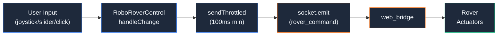

### Telemetry Path (Rover → UI)

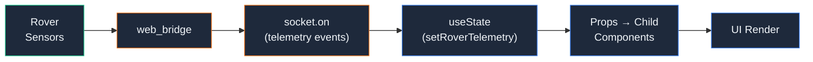

## Socket.IO Events

### Server → Client

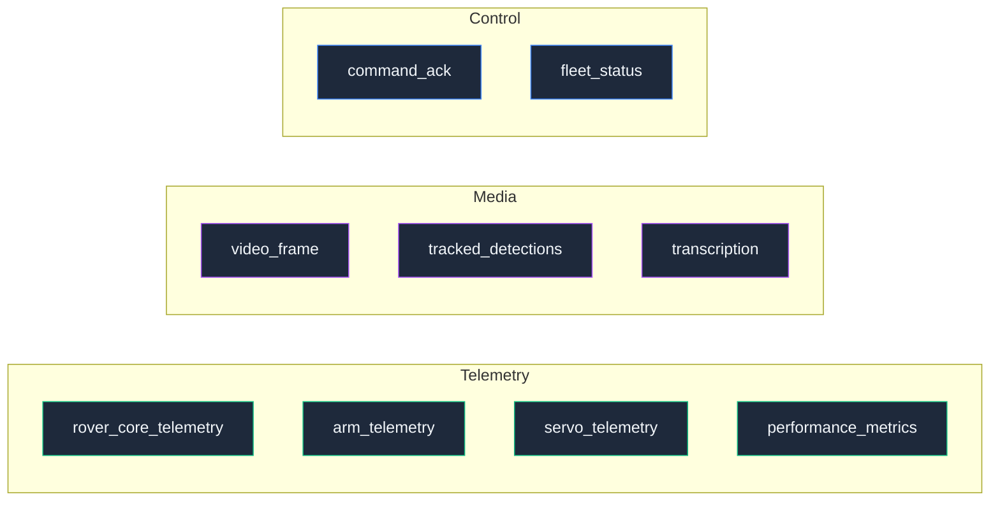

### Client → Server

| Event | Payload | Source |
|-------|---------|--------|
| `rover_command` | `WebRoverCommand` (velocity or wheel positions) | Joystick input |
| `arm_command` | `WebArmCommand` (joint positions / home / stop) | JointControlPanel |
| `tracking_command` | enable / disable / select_target | CameraViewer click |
| `fleet_select` | `FleetSelectCommand` (entity_id) | FleetSelector |
| `audio_control` | `{ command: "start" \| "stop" }` | VoiceControls |
| `tts_command` | `{ text: string }` | VoiceControls |
| `audio_stream` | Raw audio chunks | Microphone capture |
| `video_control` | start / stop / quality / FPS | CameraViewer |

## Type System

All types in `packages/shared/src/types/`, organized by domain:

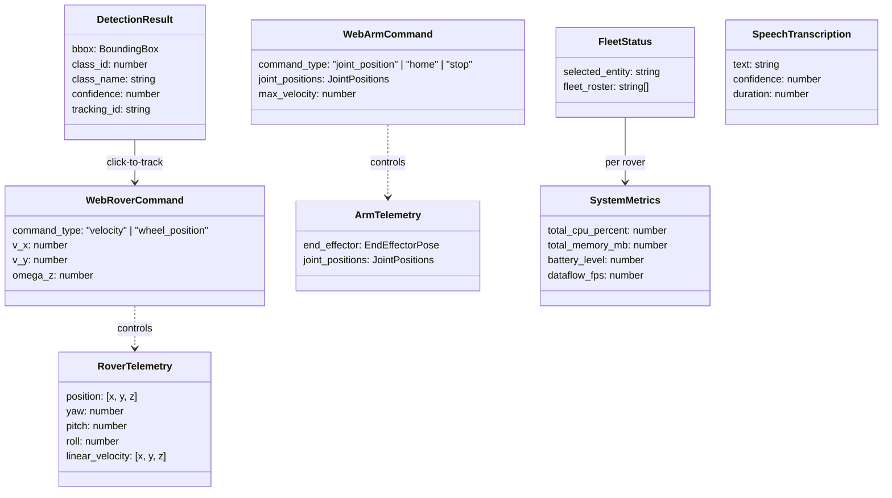

### Constants

| Constant | Purpose |
|----------|---------|
| `JOINT_LIMITS` | Min/max radians for 6-DOF arm joints |
| `DEFAULT_CLASS_COLORS` | Detection class → color map |
| `createHomePosition()` | Zero-position arm command |
| `validateJointPositions()` | Clamp values to limits |
| `getClassColor()` | Lookup color for detection class |
| `createFleetSelectCommand()` | Build fleet select payload |

## Key Features

### CameraViewer — Video + Detection Overlays

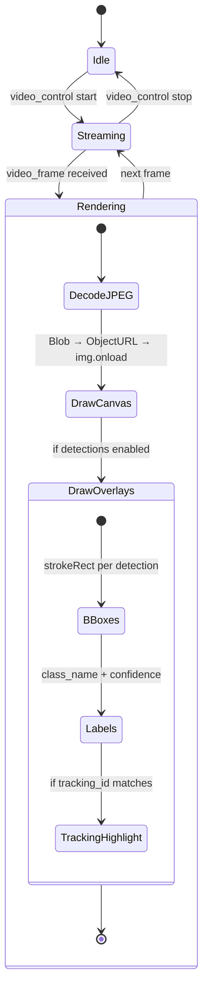

- JPEG frames rendered on `<canvas>` via `Blob` + `createObjectURL`
- Detection overlays with Canvas 2D API (bounding boxes, labels, confidence %)
- Click-to-track: pixel coords → normalized bbox → find matching detection → emit `tracking_command`
- Audio: S16LE PCM → Web Audio API `AudioBuffer` queue, 8kHz low-pass filter, max queue 20

### LocationMap — 2D Path Visualization

Canvas-based grid with 1m spacing, robot position circle + heading arrow, zoom/pan via mouse wheel + drag. Integrates wheel kinematics at 50ms intervals for position estimation.

### JointControlPanel — 6-DOF Arm Control

6 `SliderControl` components, one per joint, bounded by `JOINT_LIMITS`. Each change emits a throttled `arm_command` with updated `joint_positions`.

### FleetSelector — Multi-Rover Management

Displays `fleet_roster` with per-rover metrics (battery, CPU, memory, FPS). Online detection via metrics timestamp freshness (< 10s). Click to emit `fleet_select`.

## State Management

No external state library. All state lives as local `useState` in `RoboRoverControl` and flows down as props.

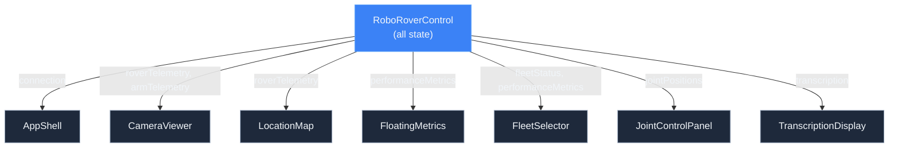

Key state:
- `connection: ConnectionState` — isConnected, clientId, commandsSent/Received
- `roverTelemetry: RoverTelemetry | null` — position, velocity, orientation
- `armTelemetry: ArmTelemetry | null` — end-effector, joint angles
- `servoTelemetry: TrackingTelemetry | null` — tracking state, control output
- `performanceMetrics: Map<string, SystemMetrics>` — per-entity metrics
- `fleetStatus: FleetStatus | null` — selected rover, roster
- `transcription: SpeechTranscription | null` — latest transcription
- `jointPositions: ExtendedJointPositions` — current slider values
- `roverVelocity: { v_x, v_y, omega_z }` — joystick output
- `logs: LogEntry[]` — event log (max 50 entries)

## Styling

**Tailwind CSS v4** with `@tailwindcss/vite` plugin. Terminal/IDE dark theme with syntax-highlighting colors.

| Token | Value | Purpose |
|-------|-------|---------|
| `--color-background` | `#0F172A` | Deep slate page bg |
| `--color-foreground` | `#F1F5F9` | Light text |
| `--color-card` | `#1E293B` | Dark panel bg |
| `--color-primary` | `#3B82F6` | VS Code blue |
| `--color-syntax-*` | 8 colors | IDE-style code highlighting |

Custom CSS classes: `.glass-card`, `.glass-card-blur`, `.gradient-bg`, `.scanline-effect`, `.btn-primary/secondary/success/warning/destructive/info`, `.glass-slider`, `.glass-input`, `.status-glow-*`.

Fonts: IBM Plex Sans (sans), JetBrains Mono / Fira Code (mono).

## Deployment

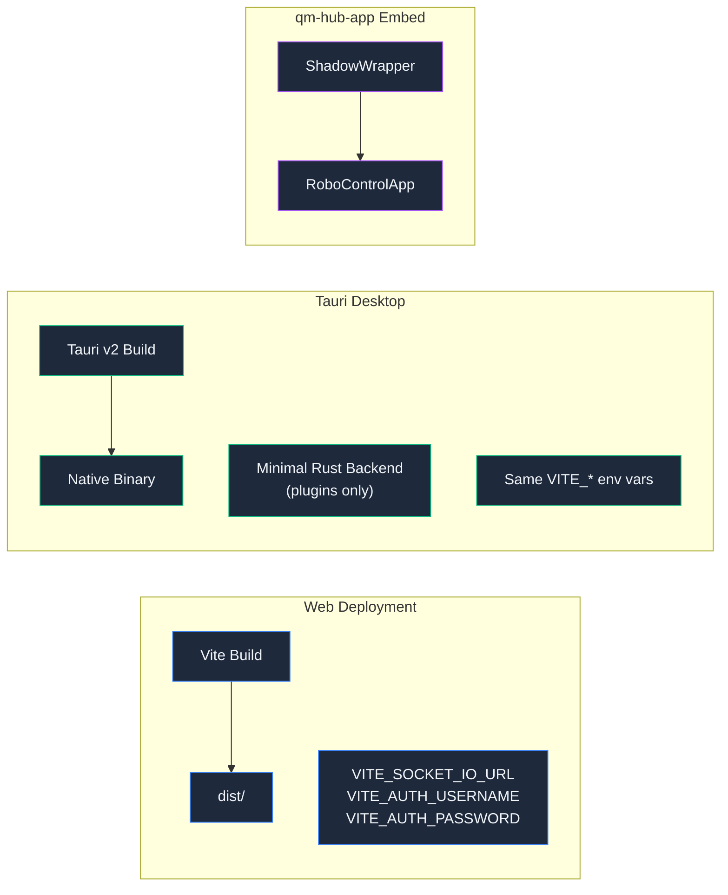

### Environment Variables

| Variable | Default | Purpose |
|----------|---------|---------|
| `VITE_SOCKET_IO_URL` | `http://localhost:3030` | Socket.IO server URL |
| `VITE_AUTH_USERNAME` | `""` | Socket.IO auth username |
| `VITE_AUTH_PASSWORD` | `""` | Socket.IO auth password |

### Tauri Backend

Minimal Rust — only `tauri_plugin_opener` initialized + placeholder `greet` command. All rover control is JavaScript/Socket.IO. No native data layer.

## qm-hub-app Embed

Robo Control is registered in `qm-hub-app` at `/robo-control/*` behind `AuthGuard + AppAccessGuard`. Entry via `RoboControlEmbed` → `ShadowWrapper` → `RoboControlApp`.

**Auth model**: `authTokens` (qm-hub JWT) accepted for interface consistency but unused. Socket.IO credentials (`auth.username`/`auth.password`) are independent — configure via `VITE_AUTH_USERNAME`/`VITE_AUTH_PASSWORD` in robo-control-app's own env.

**Fallback**: When embedded without `adapters`, `RoboControlApp` renders `RoboRoverControl` directly (Pattern A). Pattern B (service abstraction) available for future use by passing `adapters` prop.
